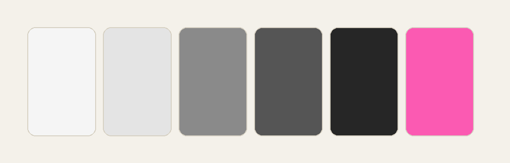

This is a deliberately long post. Its job is to exercise every element the blog can render, so the typography can be judged on real content instead of imagined content. It is also loosely about something I believe: _small things, shipped often, beat big things shipped once_.

If you only read one paragraph, read this one. Everything below is a longer way of saying it.

## Why small

A small project has a **short feedback loop**. You finish it, someone uses it, and you learn something while you still remember why you made it. A large project delays all of that, and by the time feedback arrives you've moved on.

Small also means _finishable_. Half of the unshipped work in my life was never hard, just big enough to stall on a busy week.

### A rough checklist

Before starting something new I ask:

1. Can I describe it in one sentence?
2. Can I ship a useful version in a weekend?
3. Will I still care in a month?
4. Is there anything here I'd be embarrassed to ship?

If the answer to the first three is yes, I start. If the fourth is yes, I cut that part.

## What I actually use

A few tools do most of the work. None of them are exotic:

- **Editor and terminal**
  - an editor with good TypeScript support
  - a fast terminal, plus `git` and `pnpm`
- **Writing**
  - plain Markdown files in a folder
  - a script that turns them into pages
- **Hosting**
  - a static host with free previews for every branch

The common thread is that nothing needs a server I have to babysit.

### Inline code, in context

Things you'd see in prose should look right too: run `pnpm dev` to start the server, edit `src/pages/index.astro`, and check that `Astro.props` is typed. Longer names such as `getSortedPosts()` and `--color-ink-muted` shouldn't overflow the column, even when they're long enough to wrap onto the next line.

## A small script

Here's the whole "publish pipeline" for a typical project. It's a shell script, because it only needs to be one:

```bash
#!/usr/bin/env bash
set -euo pipefail

pnpm install --frozen-lockfile
pnpm astro check
pnpm build

echo "Built $(find dist -name '*.html' | wc -l) pages"
```

And the TypeScript that sorts posts for the homepage, which is the only "logic" the site has:

```ts
import { getCollection } from 'astro:content';

export async function getSortedPosts() {
	const posts = await getCollection('blog');
	return posts.sort((a, b) => b.data.date.valueOf() - a.data.date.valueOf());
}
```

A diff is another shape worth checking, since it uses its own highlighting:

```diff
- const posts = await getCollection('blog');
+ const posts = (await getCollection('blog')).filter((post) => !post.data.draft);
```

## Comparing options

When I'm choosing between approaches I like a table, because it forces me to name the criteria:

| Approach        | Setup time | Maintenance | Good for         |
| :-------------- | :--------- | :---------- | :--------------- |
| Static site     | An hour    | Almost none | Blogs, docs      |
| Small server    | A day      | Ongoing     | Forms, accounts  |
| Hosted platform | Minutes    | Vendor-led  | Fast experiments |

None of these is wrong. The mistake is picking the most powerful one by default.

## Colour and restraint

Restraint is most of what makes a small site feel designed. A palette of a few greys and one accent goes a long way:



Everything else is spacing and type. Pick two sizes you like, and stick to them.

---

## What I'd tell my past self

> The goal isn't to build the best version of the thing. It's to build a version that exists, so you can find out what the best version is.

A few things I wish I'd internalised sooner:

- Write the post before the site is perfect.
- Link to things you admire; it's the cheapest way to say thank you. For example, the [Astro docs](https://docs.astro.build) are a good model of how to write documentation.
- Ship the **boring** version first.
- Keep a list of ideas, and _don't_ start them all.

### Next steps

If this resonated, try this over the next week:

1. Pick one idea from your list.
2. Cut it down until it fits in a weekend.
3. Ship it, however rough.
4. Tell one person about it.

That's the entire method. It isn't clever, and that's the point.
