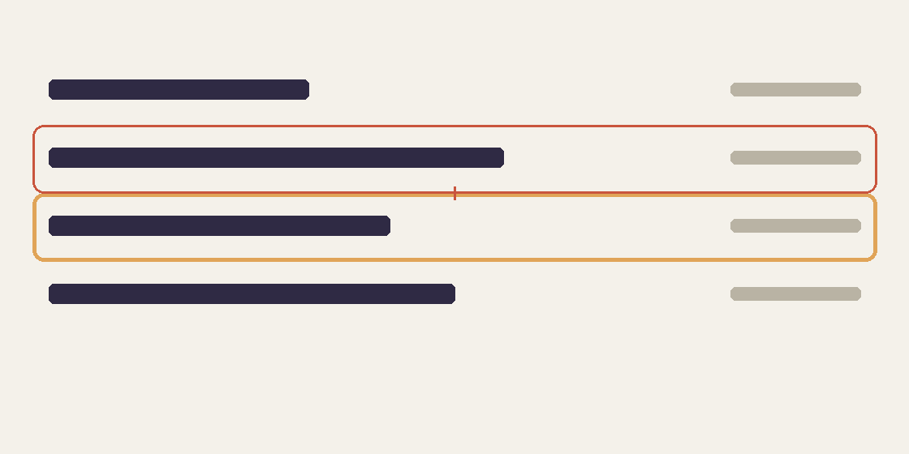

Most hover effects fade a background in on one row and out on the next. It works, but when you drag the pointer quickly down a list the highlight _flickers_ instead of _travelling_. I wanted the other thing: a single highlight that glides from row to row, the way a good native menu does.

This post walks through how it's built, why it's one element instead of many, and the handful of edge cases that took longer than the happy path.

## The idea

Instead of styling each row's `:hover` state, keep **one** highlight element behind the list and move it. Because it is a single element, a CSS `transition` on `transform` and `height` does all the animation for free:



The pieces are:

1. A relatively positioned list container.
2. One absolutely positioned highlight, `pointer-events: none`, sitting behind the rows.
3. A few event listeners that measure the hovered row and write its position to the highlight.

### Why not one background per row?

Per-row backgrounds can't _move_. Each row only knows about itself, so the best you can do is cross-fade two rows, and a fast sweep makes several rows flash in sequence. A shared element has continuous state: where it is, and where it's going.

## The markup

The list needs a `.link-highlight` element and any number of `.link-row` elements. Rows are plain anchors, so the whole row is the click target:

```astro
<div class="link-list relative -mx-3">
	<div class="link-highlight absolute top-0 left-0 w-full rounded-lg opacity-0" />
	{items.map((item) => (
		<a
			href={item.href}
			class="link-row relative flex justify-between px-3 py-1.5"
		>
			<span>{item.name}</span>
			<span>{item.meta}</span>
		</a>
	))}
</div>
```

Rows are padded by `px-3` and the list is pulled back out by `-mx-3`. That gives the highlight room around the text while the text itself stays aligned with the rest of the page.

## Moving the highlight

The core is two small functions. `show` measures a row and writes the result to inline styles; `hide` fades the highlight out:

```ts
const show = (row: HTMLElement) => {
	highlight.style.height = `${row.offsetHeight}px`;
	highlight.style.transform = `translateY(${row.offsetTop}px)`;
	highlight.style.opacity = '1';
};

const hide = () => {
	highlight.style.opacity = '0';
};
```

Then the listeners. `pointerover` bubbles, so one listener on the list is enough, and `closest()` finds the row even when the pointer is over a nested `span`:

```ts
const rowFrom = (target: EventTarget | null) =>
	(target as HTMLElement | null)?.closest<HTMLElement>('.link-row') ?? null;

list.addEventListener('pointerover', (event) => {
	const row = rowFrom(event.target);
	if (row) show(row);
});
list.addEventListener('pointerleave', hide);
```

Reading `offsetTop` and `offsetHeight` on every hover, rather than caching them, means rows can be added, removed, or reflowed without any bookkeeping. For a list of ten rows the cost is nothing.

## Edge cases

The happy path above gets you ninety percent of the way. The last ten percent is where it either feels polished or feels broken.

### The first hover shouldn't slide

If the highlight is invisible and you move onto a row, it shouldn't fly in from wherever it was last left. The fix is to skip the transition for the _first_ placement, force a layout, then restore it:

```ts
const instant = highlight.style.opacity !== '1';
if (instant) highlight.style.transition = 'none';

highlight.style.height = `${row.offsetHeight}px`;
highlight.style.transform = `translateY(${row.offsetTop}px)`;

if (instant) {
	highlight.getBoundingClientRect(); // flush styles
	highlight.style.transition = '';
}
```

The `getBoundingClientRect()` call looks pointless but isn't: without it the browser batches both style writes together and still animates.

### Keyboard users

Hover isn't the only way to land on a row. Listening to `focusin` and `focusout` gives keyboard users the same highlight for free, since the rows are real links:

```ts
list.addEventListener('focusin', (event) => {
	const row = rowFrom(event.target);
	if (row) show(row);
});
list.addEventListener('focusout', hide);
```

### Touch and reduced motion

Touch devices fire synthetic hover events that stick after a tap, which looks like a bug. Guard the pointer handler with a media query:

```ts
const canHover = window.matchMedia('(hover: hover)');
// ...
if (!canHover.matches) return;
```

For people who ask the OS for less motion, the transition should become an instant move. In Tailwind that's one utility, `motion-reduce:transition-none`.

## What it costs

| Approach               | Elements | Handles fast sweeps | Needs JS |
| :--------------------- | :------: | :-----------------: | :------: |
| Per-row `:hover` fade  |    N     |         No          |    No    |
| Shared sliding element |    1     |         Yes         |   Yes    |

The trade is real: you give up a pure-CSS solution. In return you get an effect that feels much more like a native control. For a handful of lists on a personal site, I'll take it.

> A small amount of JavaScript is a fair price for motion that responds to the pointer instead of racing it.

## Wrapping up

The whole thing is about fifty lines, lives in a single helper, and is shared by every list on the site. If you want to try it yourself, the pieces to remember are:

- one highlight element, not one per row
- measure on hover instead of caching geometry
- skip the transition on first placement
- support focus, and respect `prefers-reduced-motion`

Further reading: the [`pointerover` event on MDN](https://developer.mozilla.org/en-US/docs/Web/API/Element/pointerover_event) and the [`hover` media feature](https://developer.mozilla.org/en-US/docs/Web/CSS/@media/hover).
