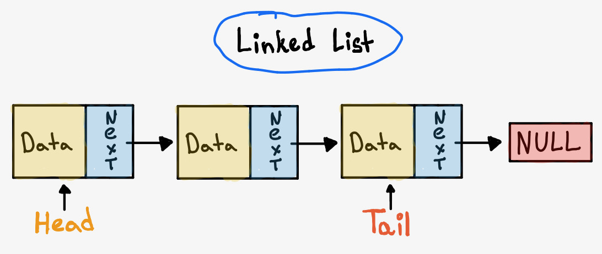
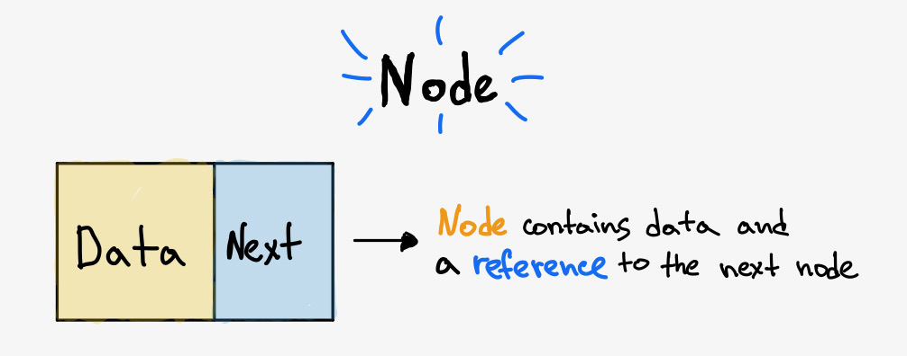
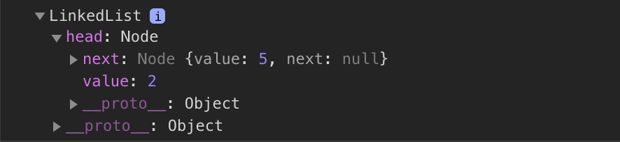
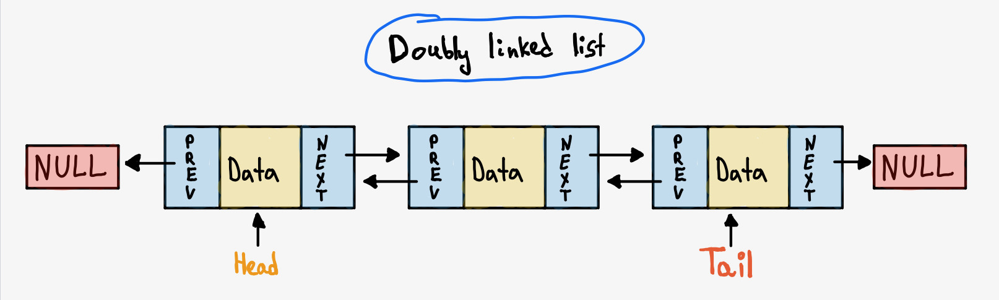

A linked list is a linear data structure, meaning its elements are stored in sequence and traversed in order. It's a good choice over arrays when you don't need random/indexed access to your data, and when you want efficient insertion or deletion at the beginning or middle of a list.

Both insertion and deletion are fast in a linked list because there's no reindexing of elements. The trade-off is that accessing a specific element takes linear time — you have to walk the list from the start to get there.

---

## Node

Every element in a linked list is stored as a **Node**. A node has two parts: the _data_ it holds, and a _reference/pointer_ to the next node.



When many nodes are linked together they form a chain — that's your linked list. There are a few common variations:

- **Singly linked list** — each node points to the next
- **Doubly linked list** — each node points to both the next and previous
- **Circular linked list** — the tail points back to the head, forming a loop (useful for things like round-robin scheduling)

---

## Singly Linked List

The simplest form. Each node holds its data and a pointer to the next node. The last node points to `null`. The entry point is called the **Head** (the first node), and the last node is called the **Tail** — you don't strictly need to track the tail, but it's handy when you need quick access to the end of the list without traversing the whole thing.


First, we need a `Node` class:

```javascript
class Node {
  constructor(value, next = null) {
    this.value = value
    this.next = next
  }
}
```

Then the `LinkedList` class itself, with `head` and `tail` starting as `null`:

```javascript
class LinkedList {
  constructor() {
    this.head = null // First element
    this.tail = null // Last element
  }
}
```

The main operations are **insert**, **search**, and **delete**. Let's go through each.

### Insertion

How you insert depends on where. If you're always inserting at the start, you just update the head:

```javascript
prepend(value) {
  // Create new node pointing to the current head
  const newNode = new Node(value, this.head);

  // New node becomes the head
  this.head = newNode;

  // If the list was empty, also set the tail
  if (!this.tail) {
    this.tail = newNode;
  }

  return this;
}
```

Let's try it out:

```javascript
const linkedList = new LinkedList()
linkedList.prepend(5)
linkedList.prepend(2)

console.dir(linkedList)
```



To insert at the end, we use the tail reference to avoid traversing the whole list:

```javascript
append(value) {
  const newNode = new Node(value);

  // If the list is empty, new node is both head and tail
  if (!this.tail) {
    this.head = newNode;
    this.tail = newNode;
    return this;
  }

  // Point current tail to the new node, then update tail
  this.tail.next = newNode;
  this.tail = newNode;

  return this;
}
```

This is why tracking the tail pays off — without it, appending would require walking the entire list every time.

### Search

To search a linked list you need to **traverse** it — starting from the head and following `next` pointers until you find what you're looking for (or reach the end).

The algorithm is straightforward:

1. Start at the head.
2. Check the current node's value.
3. If it matches, return it. If not, move to `next`.
4. Repeat until there are no more nodes.

```javascript
find(value) {
  if (!this.head) {
    return null;
  }

  let currentNode = this.head;
  while (currentNode) {
    if (currentNode.value === value) {
      return currentNode;
    }
    currentNode = currentNode.next;
  }

  return null; // Not found
}
```

> This uses iteration, but it can also be implemented recursively.

### Deletion

Deletion has a few flavours: remove the first node, remove the last, or remove by value. Removing the first node is trivial — just update the head. For anything else you need to traverse first.

Here's deletion by value:

```javascript
delete(value) {
  if (this.head === null) {
    return null;
  }

  let deletedNode = null;

  // If the head matches, update the head
  if (this.head.value === value) {
    deletedNode = this.head;
    this.head = this.head.next;
  }

  let currentNode = this.head;

  // Traverse and find the node to delete
  if (currentNode !== null && deletedNode === null) {
    while (currentNode.next !== null) {
      if (currentNode.next.value === value) {
        deletedNode = currentNode.next;
        currentNode.next = currentNode.next.next;
      } else {
        currentNode = currentNode.next;
      }
    }
  }

  // If the tail was deleted, update it
  if (this.tail && this.tail.value === value) {
    this.tail = currentNode;
  }

  return deletedNode;
}
```

---

## Doubly Linked List

Same idea as a singly linked list, but each node also holds a pointer to the **previous** node. The first node's `previous` is `null`, and the last node's `next` is `null`.

The main advantage over singly is **bidirectional traversal** — you can move forwards and backwards through the list. This also makes deletion more efficient: if you already have a reference to a node, you can remove it in O(1) without needing to traverse from the head to find its predecessor.



So each node now has:

- `next` — pointer to the next node
- `previous` — pointer to the previous node

And the list still tracks `head` and `tail`.

```javascript
class Node {
  constructor(value, next = null, previous = null) {
    this.value = value
    this.next = next
    this.previous = previous
  }
}
```

Operations are the same as singly, except you also need to keep the `previous` pointer up to date. Here's how `prepend` looks:

```javascript
class DoublyLinkedList {
  constructor() {
    this.head = null
    this.tail = null
  }

  prepend(value) {
    const newNode = new Node(value, this.head)

    // Old head's previous should now point to the new node
    if (this.head) {
      this.head.previous = newNode
    }
    this.head = newNode

    if (!this.tail) {
      this.tail = newNode
    }

    return this
  }
}
```

Full implementations are linked below.

---

## Time Complexity

| Operation                | Complexity |
| ------------------------ | ---------- |
| Access                   | O(n)       |
| Insertion (head or tail) | O(1)       |
| Search                   | O(n)       |
| Deletion                 | O(n)       |

**N** is the length of the linked list.

---

## Links

- [Linked List implementations in TypeScript](https://github.com/TheAlgorithms/TypeScript/tree/master/data_structures/list) on GitHub
- [Linked list vs Array](https://www.geeksforgeeks.org/linked-list-vs-array/) on GeeksForGeeks
- [Practice linked list problems](https://leetcode.com/tag/linked-list/) on LeetCode
