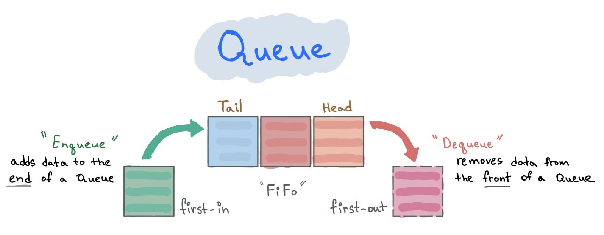

A Queue is a linear data structure where one end is used to add data and the other end is used to remove it. We use queues in everyday life all the time - waiting in line at a supermarket, boarding a plane.

This ordering is called **FIFO** (first-in-first-out) - the first element added is the first one processed, and the most recently added has to wait the longest. It's the opposite of a Stack, which uses LIFO (last-in-first-out).

Like an array, but with a couple of restrictions:

- You can't randomly access an item by index.
- You can only add to one end and remove from the other.

---

## Operations

| Operation       | Description                               |
| --------------- | ----------------------------------------- |
| `enqueue(item)` | Add an item to the end of the queue       |
| `dequeue()`     | Remove the item at the front of the queue |
| `peek()`        | Read the front item without removing it   |

## When to Use It

Queues are the right tool whenever the first thing that arrives needs to be processed first. Some examples:

- **Task scheduling** - processing jobs in the order they were submitted
- **Upload queues** - uploading images one by one in the order they were added
- **BFS (Breadth-First Search)** - graph/tree traversal processes nodes level by level
- **Rate limiting** - queuing requests to be processed at a controlled pace
- **Priority Queue** - a variant worth knowing about: if elements need to be processed by priority rather than arrival order, a Priority Queue is the right tool

## Time Complexity

| Operation | Complexity |
| --------- | ---------- |
| Insertion | O(1)       |
| Deletion  | O(1)       |
| Access    | O(n)       |

> To access a specific value you need to dequeue everything in front of it first.

## Implementation

A queue can be implemented using an array. We add to the end with `push` and remove from the front with `shift`:

```typescript
export class Queue<T> {
  private storage: T[] = []

  /** Add a new element to the end of the queue */
  public enqueue(value: T): void {
    this.storage.push(value)
  }

  /** Remove and return the element at the front of the queue */
  public dequeue(): T | undefined {
    return this.storage.shift()
  }

  /** Read the front element without removing it */
  public peek(): T | undefined {
    return this.storage[0]
  }

  public isEmpty(): boolean {
    return this.storage.length === 0
  }

  public size(): number {
    return this.storage.length
  }
}
```

One thing worth knowing: `shift()` is O(n) because it removes the first element and reindexes the rest of the array. For most use cases this is fine, but if you're dealing with very large queues or performance-critical code, backing the queue with a Linked List gives you true O(1) deletions from the front.

---

## Links

- [Data Structures: Linked List](/posts/data-structures-linked-list)
- [Data Structures: Stack](/posts/data-structures-stack)
- [Practice Queue problems](https://leetcode.com/tag/queue/) on LeetCode
- [Big-O Cheat Sheet](https://www.bigocheatsheet.com/)
