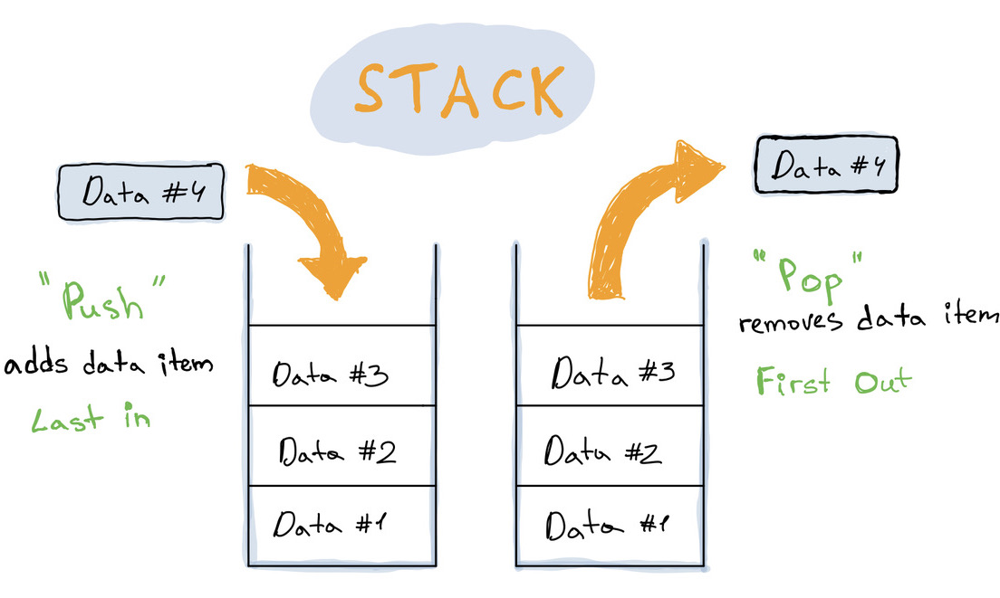

A Stack is a linear data structure where elements are stacked on top of each other. It's similar to an array, but with a couple of restrictions:

- You can't access items randomly by index.
- You can only add an item to the top, and remove or read from the top.

The easiest way to picture it is a stack of plates. You put a plate on top, and to get to one in the middle you have to work your way down from the top.

A stack uses **LIFO** (last-in-first-out) ordering - the last item pushed onto the stack is the first one processed.

---

## Operations

| Operation | Description                           |
| --------- | ------------------------------------- |
| `push()`  | Add an item to the top                |
| `pop()`   | Remove the top item                   |
| `peek()`  | Read the top item without removing it |

## When to Use It

- **Balanced brackets/parentheses** - checking that every opening `(`, `[`, `{` has a matching closing one
- **Undo functionality** - each action is pushed onto a stack, undo pops the last one
- **Reversing data** - push everything in, pop it all out in reverse order
- **Backtracking algorithms** - depth-first search, maze solving, etc.

## Time Complexity

| Operation | Complexity |
| --------- | ---------- |
| Insertion | O(1)       |
| Deletion  | O(1)       |
| Access    | O(n)       |

> To access a specific value you first need to pop everything above it.

## Implementation

A stack maps naturally onto a JavaScript array - `push` and `pop` are already there, so the implementation is mostly just wrapping them with a clean interface:

```typescript
export class Stack<T> {
  private storage: T[] = []

  public push(value: T): void {
    this.storage.push(value)
  }

  public pop(): T | undefined {
    return this.storage.pop()
  }

  public peek(): T | undefined {
    return this.storage[this.storage.length - 1]
  }

  public isEmpty(): boolean {
    return this.storage.length === 0
  }

  public size(): number {
    return this.storage.length
  }
}
```

This works well for most use cases. If you need better memory performance with very frequent insertions and deletions, you could back the stack with a [Linked List](/posts/data-structures-linked-list) instead - insertions and deletions at the tail are O(1) with no array resizing overhead.

---

## Links

- [Data Structures: Linked List](/posts/data-structures-linked-list)
- [Stack implementations in TypeScript](https://github.com/TheAlgorithms/TypeScript/tree/master/data_structures) on GitHub
- [Practice Stack problems](https://leetcode.com/tag/stack/) on LeetCode
- [Big-O Cheat Sheet](https://www.bigocheatsheet.com/)
