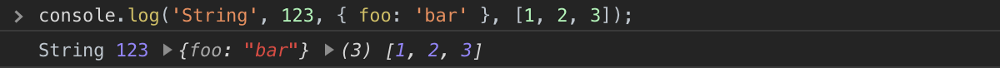
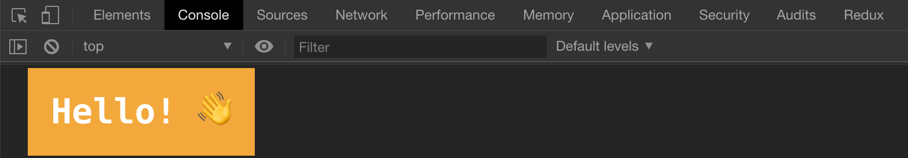
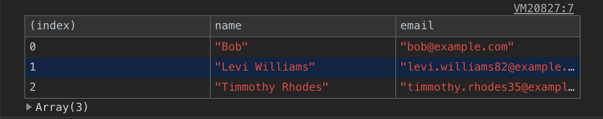
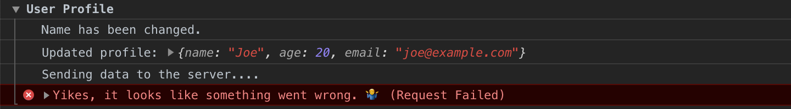
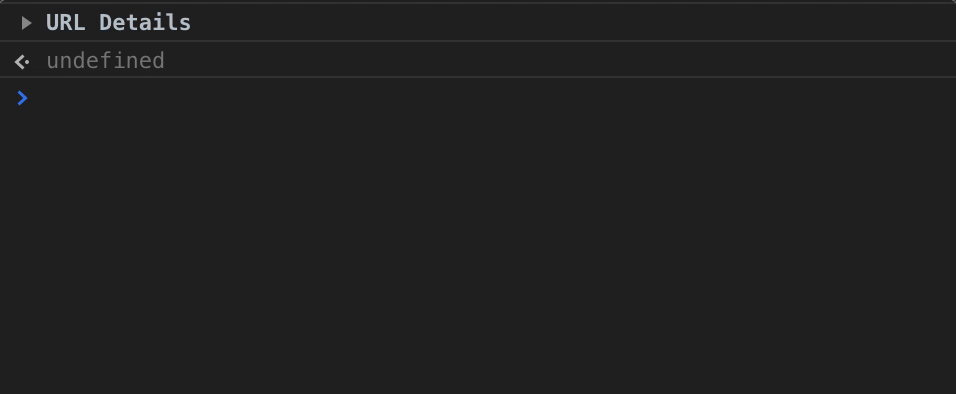
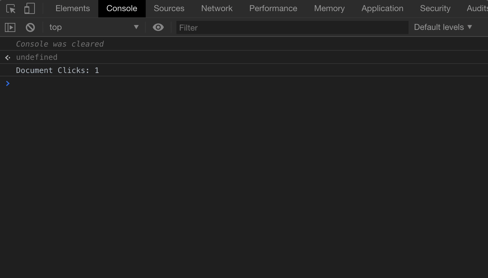
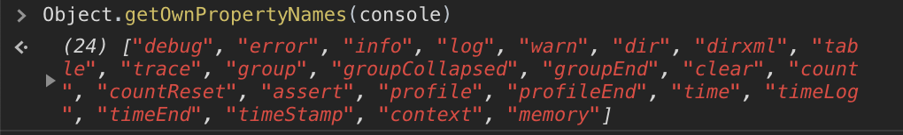

`console.log` is one of the most basic and widely-used debugging tools in JavaScript.
The `console` object gives us access to the browser's console and lets us output all kinds of data to help with debugging.
It has many methods that most developers don't even know exist. In this article, I want to share some of the most useful ones.

---

## console.log() and friends

The most commonly used `console` method is, of course, `console.log()`.
But there are several other methods that make output more descriptive and easier to scan.

| Method          | Description                                                    |
| --------------- | -------------------------------------------------------------- |
| `console.log`   | Used for general output                                        |
| `console.info`  | Outputs an informational message. In Chrome it's same as `log` |
| `console.warn`  | Outputs a warning message                                      |
| `console.error` | Outputs an error message. Also, includes stack trace           |

If you pass multiple parameters in the selected method, they will be appended together in the same order.

```javascript
console.log('String', 123, { foo: 'bar' }, [1, 2, 3])
```



**String Substitutions**

This technique lets us define placeholders inside a string that get replaced by the other arguments passed to the function.

```javascript
console.log('String %s usage', 'Substitutions')
// -> String Substitutions usage
```

It's also possible to use placeholders for different types of values:

| Format Specifier | Description                    |
| ---------------- | ------------------------------ |
| `%s`             | String                         |
| `%i` or `%d`     | Integer                        |
| `%f`             | Floating point number          |
| `%o`             | DOM element or object          |
| `%O`             | `console.dir` behaviour        |
| `%c`             | Applies CSS to the log message |

The most interesting specifier is `%c` — the others are fairly self-explanatory, and for simple string interpolation you'll likely just reach for ES6 template literals anyway.

```javascript
const str = 'Substitutions'
console.log(`String ${str} usage`)
// -> String Substitutions usage
```

The `%c` specifier lets you apply CSS styles directly to console output.
Let's make our logs pop with some colour.

```javascript
const styles = [
  'background: orange',
  'color: white',
  'font-size: 30px',
  'font-weight: 700',
  'padding: 20px'
].join(';')

console.log('%cHello! 👋', styles)
```



---

## console.table()

This method displays tabular data in a clean, readable table. It's far easier to scan than the raw output you'd get from `console.log`, especially when inspecting arrays of objects returned from an API.

```javascript
const contacts = [
  { name: 'Bob', email: 'bob@example.com' },
  { name: 'Levi Williams', email: 'levi.williams82@example.com' },
  { name: 'Timmothy Rhodes', email: 'timmothy.rhodes35@example.com' }
]

console.table(contacts)
```



The first column is always `index`. For arrays it shows the element indices; for objects it shows the property names.

---

## console.dir()

This method is similar to `console.log` but displays an interactive list of an object's properties.
It's especially useful when inspecting DOM elements.

```javascript
const link = document.getElementsByTagName('a')[0]
console.log('⬇ console.log:')
console.log(link)
console.log('⬇ console.dir:')
console.dir(link)
```


You can get the same result using `console.log` with the `%o` placeholder:

```javascript
console.log('%o', document.body)
```

---

## console.group()

This method is useful for grouping related log output together. It takes an optional label parameter, and the group ends when you call `console.groupEnd()`.

```javascript
console.group('User Profile')
console.log('Name has been changed.')
console.log('Updated profile:', {
  name: 'Joe',
  age: 20,
  email: 'joe@example.com'
})
console.log('Sending data to the server....')
console.error('Yikes, it looks like something went wrong. 🤷‍♂️ (Request Failed)')
console.groupEnd()
```



There's also `console.groupCollapsed()`, which works the same way but starts the group collapsed by default:

```javascript
console.groupCollapsed('URL Details')
console.log('Host: example.com')
console.log('Protocol: https')
console.log('Path: /hello')

console.group('Query string parameters')
console.log('id: 5')
console.log('message: Hello')
console.groupEnd()
console.groupEnd()
```



As you can see it's also possible to create groups inside groups.

---

## console.time()

The `console.time(label)` method measures how long a piece of code takes to execute. Call `console.timeEnd(label)` to stop the timer and log the result.

```javascript
console.time()
// 🕐 some code...
console.timeEnd() // -> default: 3.696044921875ms

// ⬇ or with label
console.time('array parsing')
// 🕐 some code...
console.timeEnd('array parsing') // -> array parsing: 2.5419921875ms
```

---

## console.count()

The `console.count(label)` method outputs the number of times it has been called with a given label.

```javascript
document.addEventListener('click', () => console.count('Document Clicks'))
```

To reset the counter, use `console.countReset(label)`:

```javascript
console.countReset('Document Clicks')
```



---

## console.clear()

The `console.clear()` method clears output in the console window.

---

## Conclusion

`console.log` is the go-to method for quick debugging, but as you can see there are plenty of other methods that are more effective in the right situation.

The `console` object has even more methods beyond what's covered here:



You can read more about them here [MDN Web Docs](https://developer.mozilla.org/en-US/docs/Web/API/console).
