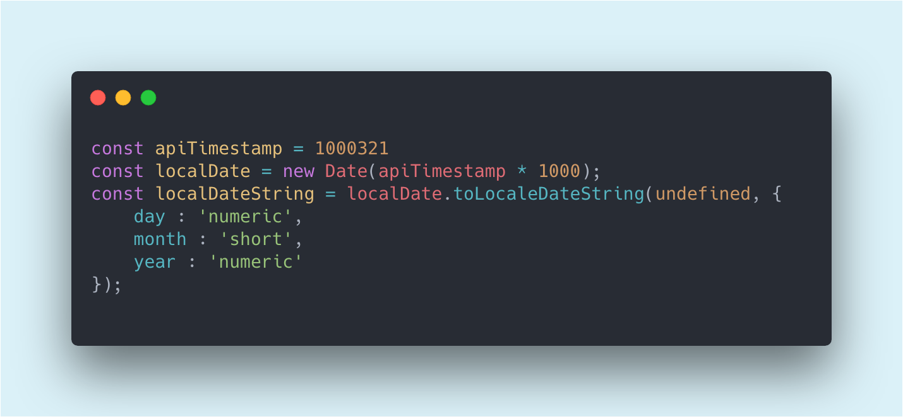

Dates in JS have always been one of my weaker spots. I'd figure it out somehow, get it working, and then forget everything a week later. So I figured writing it all down would help it stick.

This isn't an exhaustive reference, but it should give you a solid feel for the tools available and how to handle the situations that come up most often. The first part covers the basics — a bit dry, but worth knowing. The second part is where it gets more interesting.

Let's go! 😀

---

## Initialization

JavaScript gives you four ways to create a `Date` object:

```javascript
new Date() // Now
new Date(year, month, day, hours, minutes, seconds, milliseconds) // specific date
new Date(milliseconds) // milliseconds since Jan 1, 1970, 00:00:00 UTC
new Date('date string') // date string to parse
```

### new Date()

No arguments needed — call it and you get the current date and time. Simple as that.

> In some cases it's better to use `Date.now()` instead, as it returns a plain number (timestamp) without the overhead of creating a `Date` object.

### new Date(year, month...)

Need a specific date? Pass in the components one by one.

```javascript
new Date(2019, 3, 12, 22) // Fri Apr 12 2019 22:00:00 ...
new Date(2019, 2, 21) // Thu Mar 21 2019 00:00:00 ...
new Date(2019, 2) // Fri Mar 01 2019 00:00:00 ...
```

A couple of gotchas to keep in mind:

- You don't need to pass all parameters, but you must provide at least year and month — otherwise `new Date(2019)` is treated as milliseconds.
- **Month is zero-indexed** — it starts at 0 (January) and ends at 11 (December).

### new Date(milliseconds)

Under the hood, JavaScript stores time as the number of milliseconds since **Jan 1, 1970, 00:00:00 UTC** — also known as the Unix epoch.

```javascript
new Date(0) // Jan 1, 1970, 00:00:00 UTC
```

Every other date is just an offset from that point. One thing to watch: UNIX timestamps are in seconds, but JavaScript wants milliseconds — so multiply by `1000`:

```javascript
const unixTimestamp = 1552413600
new Date(unixTimestamp * 1000) // Tue Mar 12 2019 20:00:00 GMT+0200
```

### new Date('date string')

The most readable option — just pass a string and JavaScript will use `Date.parse()` to figure it out.

```javascript
new Date('2018-07') // July 1st 2018, 00:00:00
new Date('July 22, 2018 07:22:13')
new Date('2018-07-22T07:22:13') // ISO
new Date('2018-03-14T12:00+04:00') // ISO with custom timezone
new Date('2018 March') // Mar 1st 2018, 00:00:00
```

> If you don't set a timezone explicitly, the result is relative to your local timezone.

Flexible, but it comes with cross-browser landmines. Omitting a leading zero, for example, works fine in Chrome and Firefox but gives you an invalid date in Safari:

```javascript
new Date('2018-7-22') // Invalid in Safari
new Date('2018 march') // Invalid in Safari
new Date('2018-07-2') // Invalid in Safari
```

> To avoid these issues, use the [ISO 8601 format](http://www.ecma-international.org/ecma-262/5.1/#sec-15.9.1.15) wherever possible.

And if you only need the raw timestamp, `Date.parse()` is there for you:

```javascript
Date.parse('2018-07') // July 1st 2018, 00:00:00
Date.parse('2018/07/22')
Date.parse('July 22, 2018')
Date.parse('July 22, 2018 07:22:13')
Date.parse('2018-07-22T07:22:13')
```

---

## Get a Date

Once you have a date, you'll probably want to read something out of it. There's a getter for pretty much every component:

| Method                | Description                                                               |
| --------------------- | ------------------------------------------------------------------------- |
| `getFullYear()`       | Get the year (yyyy)                                                       |
| `getMonth()`          | Get the month as a number (0–11)                                          |
| `getDate()`           | Get the day of the month (1–31)                                           |
| `getHours()`          | Get the hour (0–23)                                                       |
| `getMinutes()`        | Get the minutes (0–59)                                                    |
| `getSeconds()`        | Get the seconds (0–59)                                                    |
| `getMilliseconds()`   | Get the milliseconds (0–999)                                              |
| `getTime()`           | Get the timestamp (milliseconds since January 1, 1970)                    |
| `getDay()`            | Get the weekday as a number (0–6)                                         |
| `getTimezoneOffset()` | Get the timezone difference in minutes between the local timezone and UTC |

Each of these has a UTC equivalent too: `getUTCFullYear()`, `getUTCMonth()`, `getUTCDate()`, and so on.

Need a string instead? There's a set of methods for that as well:

| Method           | Description                                       |
| ---------------- | ------------------------------------------------- |
| `toString()`     | Converts date to a string                         |
| `toTimeString()` | Returns only the time portion                     |
| `toUTCString()`  | Converts to a string using UTC timezone           |
| `toDateString()` | Converts only the date (without time) to a string |
| `toISOString()`  | Converts to a string in ISO 8601 format           |

```javascript
const date = new Date('July 22, 2018 07:22:13')

date.toString() // "Sun Jul 22 2018 07:22:13 GMT+0200 (Central European Summer Time)"
date.toTimeString() // "07:22:13 GMT+0200 (Central European Summer Time)"
date.toUTCString() // "Sun, 22 Jul 2018 05:22:13 GMT"
date.toDateString() // "Sun Jul 22 2018"
date.toISOString() // "2018-07-22T05:22:13.000Z"
```

There's one more — `toLocaleDateString()` — but it deserves its own section.

---

## Edit a Date

For every `get` method there's a matching `set`. The API is pretty symmetrical once you know one side of it.

| Method              | Description                                    |
| ------------------- | ---------------------------------------------- |
| `setDate()`         | Sets the day of the month (1–31)               |
| `setFullYear()`     | Sets the year                                  |
| `setHours()`        | Sets the hours (0–23)                          |
| `setMilliseconds()` | Sets the milliseconds (0–999)                  |
| `setMinutes()`      | Sets the minutes (0–59)                        |
| `setMonth()`        | Sets the month (0–11)                          |
| `setSeconds()`      | Sets the seconds (0–59)                        |
| `setTime()`         | Sets the time (milliseconds since Jan 1, 1970) |

```javascript
const d = new Date('2019-01-12') // Jan 12 2019

d.setMonth(2) // Mar 12 2019
d.setDate(1) // Mar 01 2019
```

> `setFullYear()` can set year, month, and day all at once: `date.setFullYear(2019, 3, 20)`

---

## Format and Localize a Date

Now for the more interesting part.

Say you need to format a date as `dd/mm/yyyy`. The instinctive approach is to stitch together `get` methods:

```javascript
/** Adds leading zero */
const pad = (num) => String(num).padStart(2, 0)

const convertDate = (dateString) => {
  const date = new Date(dateString)
  return `${pad(date.getDate())}/${pad(date.getMonth())}/${date.getFullYear()}`
}
```

And if you need the month name too, like "14 July 2019"? You'd probably reach for an array of month names:

```javascript
const months = [
  'January',
  'February',
  'March',
  'April',
  'May',
  'June',
  'July',
  'August',
  'September',
  'October',
  'November',
  'December'
]

const convertDate = (dateString) => {
  const date = new Date(dateString)
  return `${pad(date.getDate())}.${months[date.getMonth()]}.${date.getFullYear()}`
}
```

It works, but it's a lot of code for something so common. `toLocaleDateString()` does this in one line and handles localization for free:

```javascript
const convertDate = (dateString) =>
  new Date(dateString).toLocaleDateString('en-GB', {
    day: 'numeric',
    month: 'numeric',
    year: 'numeric'
  })

console.log(convertDate('2019-02-12')) // -> 12/02/2019
```

```javascript
const convertDate = (dateString) =>
  new Date(dateString).toLocaleDateString('en-GB', {
    day: 'numeric',
    month: 'long',
    year: 'numeric'
  })

console.log(convertDate('2019-02-12')) // -> 12 February 2019
```

Much cleaner 🎉. You can learn more about `toLocaleDateString` on [MDN](https://developer.mozilla.org/en-US/docs/Web/JavaScript/Reference/Global_Objects/Date/toLocaleDateString).

---

## Compare Dates

Comparing dates is simpler than you might think — the standard operators just work:

```javascript
const date1 = new Date('2005-07-20')
const date2 = new Date('2000-10-08')

if (date1 > date2) {
  console.log('date1 is more recent')
} else {
  console.log('date2 is more recent')
}
```

One thing to watch out for: since `Date` is an object, using === or == compares by reference, not value. Two separate `Date`objects representing the same point in time will not be equal

For equality checks though, use `getTime()` to compare the raw timestamps:

```javascript
const date1 = new Date('2019-03-12T10:10:10')
const date2 = new Date('2019-03-12T10:10:10')

if (date1.getTime() === date2.getTime()) {
  console.log('dates are equal 🎉')
}

// Get the difference in milliseconds
console.log(date1.getTime() - date2.getTime()) // 0
```

You can also compare specific parts (year only, month only, etc.) using the `get` methods from earlier.

---

## Practice

**1. What year does `new Date(0)` represent?**

<details>
<summary>Answer</summary>

1970 — JavaScript calculates dates in milliseconds starting from January 1st, 1970 (the Unix epoch).

</details>

**2. Change the month to October and year to 2018 in `new Date(2012, 1)`**

<details>
<summary>Answer</summary>

Remember that months are zero-indexed — October is `9`:

```javascript
new Date(2012, 1).setFullYear(2018, 9)
```

</details>

**3. Sort this array from oldest to newest date:**

```javascript
const usersArr = [
  { name: 'John', date: '2019-02-13' },
  { name: 'Bob', date: '2018-03-12' },
  { name: 'Emma', date: '2018-11-06' },
  { name: 'Mia', date: '2018-01-20' },
  { name: 'William', date: '2016-01-05' }
]
```

<details>
<summary>Answer</summary>

```javascript
usersArr.sort((a, b) => new Date(a.date) - new Date(b.date))
```

</details>

**4. Create a `timeAgo` function:**

```javascript
// - Accepts a UNIX timestamp
// - Returns: 'now', '1m', '2h', 'June 11', 'Mar 15, 2019'
//   < 1 minute  → 'now'
//   < 1 hour    → 'Xm'
//   < 1 day     → 'Xh'
//   < 1 year    → 'June 11', 'Mar 5'
//   >= 1 year   → 'Mar 15, 2019'

const unixTimestamp = Date.now() / 1000
console.log(timeAgo(unixTimestamp)) // "now"
console.log(timeAgo(unixTimestamp - 60)) // "1m"
console.log(timeAgo(unixTimestamp - 4 * 60 * 60)) // "4h"
console.log(timeAgo(unixTimestamp - 5 * 24 * 60 * 60)) // "Mar 9"
console.log(timeAgo(unixTimestamp - 365 * 24 * 60 * 60)) // "Mar 14, 2018"
```

<details>
<summary>Answer</summary>

```javascript
const timeAgo = (unixDate) => {
  const date = new Date(unixDate * 1000)
  const secondsDiff = (Date.now() - date) / 1000

  const minutes = secondsDiff / 60
  const hours = minutes / 60
  const days = hours / 24
  const years = days / 365

  if (secondsDiff < 0) return "😱 OMG it's a future!"

  if (years >= 1) {
    return date.toLocaleDateString('en-US', { day: 'numeric', month: 'short', year: 'numeric' })
  } else if (days >= 1) {
    return date.toLocaleDateString('en-US', { day: 'numeric', month: 'short' })
  } else if (hours >= 1) {
    return `${Math.round(hours)}h`
  } else if (minutes >= 1) {
    return `${Math.round(minutes)}m`
  }

  return 'now'
}
```

</details>
